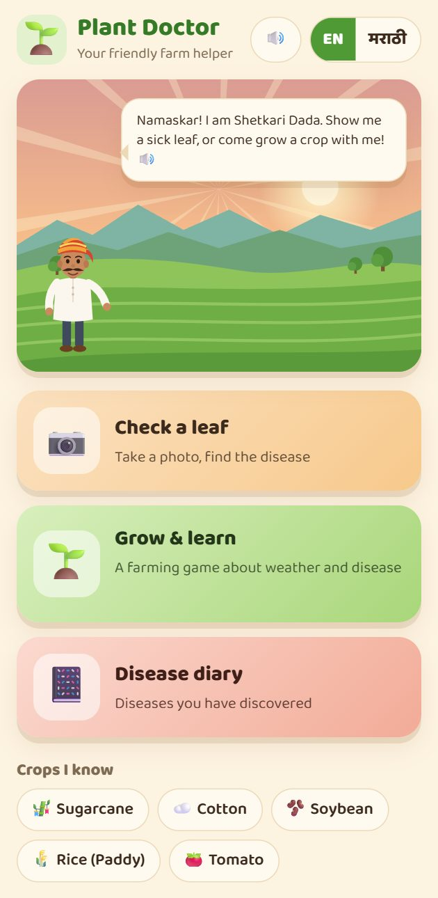
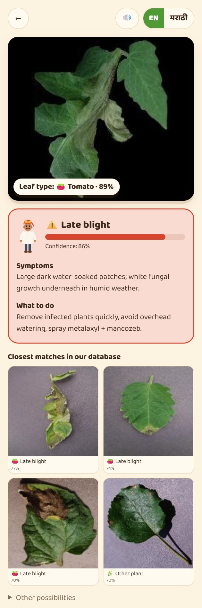
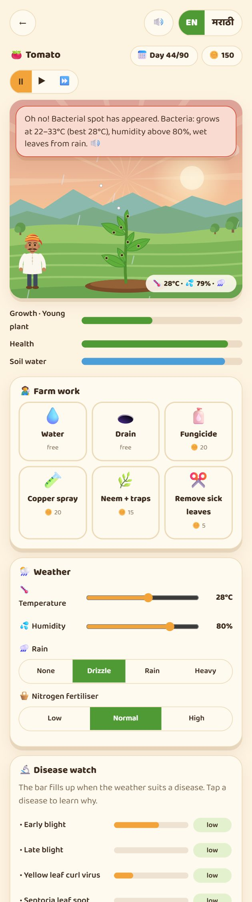
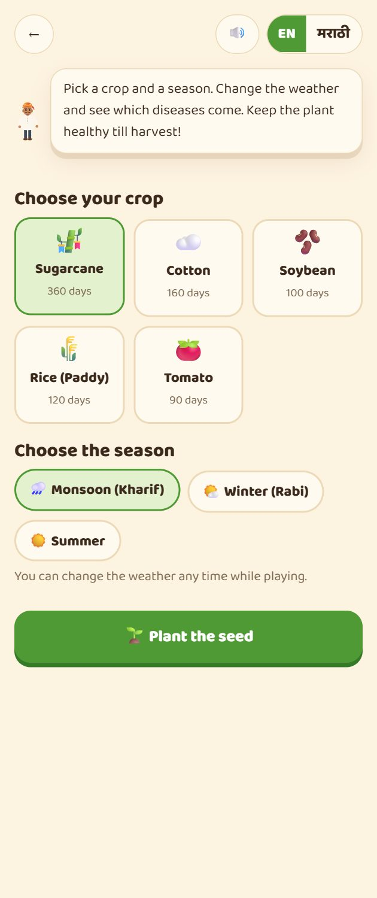
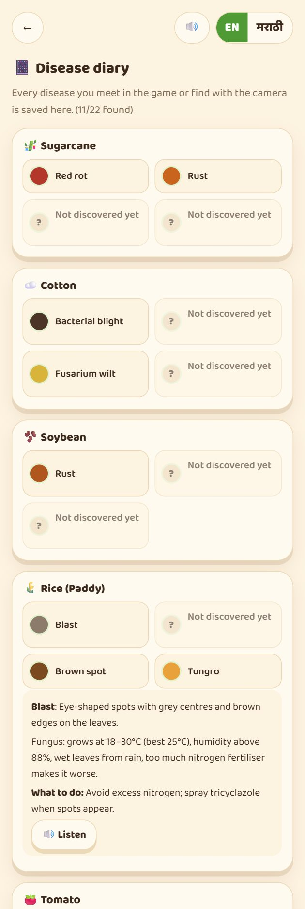
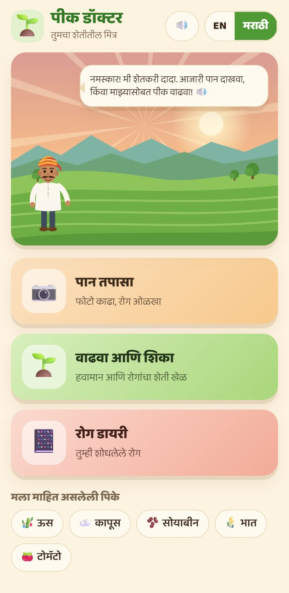
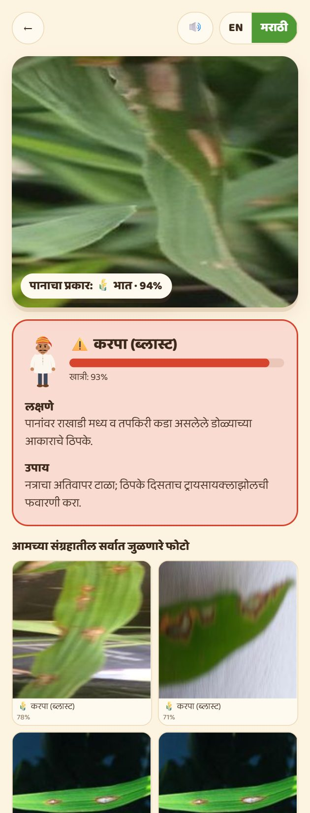

# 🌱 Plant Doctor · पीक डॉक्टर

A cozy, bilingual (English / मराठी) farm helper for five of the most common crops of Maharashtra.
Snap a leaf to find its disease, or grow a crop in a little weather-and-disease game to learn **why** diseases appear.

It is an installable web app (PWA). The AI model runs **on the device**, so it works offline, costs nothing to run,
and photos never leave the phone.

**Crops:** 🎋 Sugarcane (ऊस) · ☁️ Cotton (कापूस) · 🫘 Soybean (सोयाबीन) · 🌾 Rice (भात) · 🍅 Tomato (टोमॅटो)

<p align="center">
  
  
  
</p>

---

## Features

### 📷 Check a leaf
Take a photo with the camera, or upload one. The model:
1. **identifies the leaf type** (which of the 5 crops, or "not a crop I know"),
2. **diagnoses the condition** (27 conditions, including "healthy"), with a confidence score,
3. **shows the closest matching photos from its reference database**, so you can compare by eye,
4. explains **symptoms and what to do**, and reads it aloud with 🔊 in English or Marathi.

If confidence is low it asks for a better photo instead of guessing.

### 🌱 Grow & learn (the game)
Pick a crop and a season (Kharif monsoon, Rabi winter or summer), then play with **temperature, humidity, rain and
nitrogen fertiliser**. Each disease has its own weather "recipe" based on real plant pathology: a temperature window,
a humidity threshold, how much wet leaves matter, insect carriers for viruses (whitefly, aphids, leafhoppers) and
nitrogen effects. When conditions suit a disease, its bar fills up and it breaks out on the plant with its own look
(rings, rust pustules, streaks, mottling, wilting, curling).

Save the harvest with farm work: 💧 water, 🕳️ drain, 🧴 fungicide, 🧪 copper spray, 🌿 neem + traps, ✂️ remove sick
leaves. Shetkari Dada explains what happened and why. Every sound is generated in code with the Web Audio API.

### 📔 Disease diary
Every disease you meet in the game or find with the camera is collected, with its explanation and treatment.

<p align="center">
  
  
  
  
</p>

---

## Quick start

### Just use it
Open the GitHub Pages link for this repo on any phone or computer and tap **Install / Add to Home screen**.

> First time: in the repo go to **Settings → Pages → Source: GitHub Actions**. After that every push to `main`
> deploys automatically (`.github/workflows/deploy.yml`).

### Run it locally (one click)
Needs [Node.js 20+](https://nodejs.org).

| OS | Do this |
|---|---|
| Windows | double-click `setup.bat` |
| Mac / Linux | `./setup.sh` |

Or by hand:
```bash
cd app
npm install
npm run dev
```
Open http://localhost:5173.

**Camera on your phone:** browsers only allow the camera over HTTPS. Run `setup.bat https` (or `npm run dev:https`),
open the `https://<your-pc-ip>:5173` address it prints on your phone (same Wi-Fi), and accept the certificate warning.

---

## How it works

```
 phone camera ──► centre crop 224×224 ──► MobileNetV3 (ONNX Runtime Web, WebGPU / WASM)
                                              │
                         ┌────────────────────┴──────────────────────┐
                    logits (28)                          embedding (1280-d)
                         │                                           │
          condition + crop totals + confidence       cosine similarity vs 168 reference photos
                         │                                           │
                         └──────► result card (EN / मराठी, TTS) ◄────┘
```

- **Model:** MobileNetV3-Large (ImageNet-pretrained via `timm`), fine-tuned at 224 px with augmentation and label
  smoothing, exported to ONNX (17 MB) with two outputs: `logits` and a normalised `embedding`.
- **Reference database:** the 6 most typical validation photos per class, stored as thumbnails with int8-quantised
  embeddings (`app/public/models/refs.json`), searched in the browser.
- **Inference:** about 20 ms per photo on a laptop after the first load; it runs fully offline once the app is cached.
- **Speech:** Web Speech API (`en-IN`, `mr-IN`, falling back to a Hindi voice for Devanagari when no Marathi voice is
  installed).

### Accuracy
Validation accuracy **98.7%** on 1,853 held-out images (15 epochs on a Colab T4 GPU).

<details>
<summary>Per-class validation accuracy</summary>

| Crop | Condition | Accuracy |
|---|---|---|
| Cotton | alternaria leaf spot | 84.0% |
| Cotton | bacterial blight | 96.9% |
| Cotton | fusarium wilt | 98.0% |
| Cotton | healthy | 100.0% |
| Cotton | verticillium wilt | 95.7% |
| Rice | bacterial leaf blight | 100.0% |
| Rice | blast | 98.3% |
| Rice | brown spot | 100.0% |
| Rice | healthy | 100.0% |
| Rice | tungro | 100.0% |
| Soybean | bacterial blight | 100.0% |
| Soybean | frogeye leaf spot | 100.0% |
| Soybean | healthy | 100.0% |
| Soybean | rust | 97.9% |
| Sugarcane | healthy | 96.3% |
| Sugarcane | mosaic | 91.7% |
| Sugarcane | red rot | 98.1% |
| Sugarcane | rust | 100.0% |
| Sugarcane | yellow leaf | 100.0% |
| Tomato | bacterial spot | 98.4% |
| Tomato | early blight | 100.0% |
| Tomato | healthy | 100.0% |
| Tomato | late blight | 98.2% |
| Tomato | leaf curl | 98.3% |
| Tomato | leaf mould | 96.4% |
| Tomato | mosaic virus | 100.0% (only 74 images, so treat with caution) |
| Tomato | septoria leaf spot | 100.0% |
| Other | unsupported plant | 99.2% |
</details>

> ⚠️ **Honest limits.** Validation images come from the same datasets as training. Tomato photos are
> PlantVillage lab shots on plain backgrounds, so real field photos will score lower than these numbers. The app
> shows its confidence and asks for a retake when unsure. It is a learning and first-aid tool, **not** a lab
> diagnosis: confirm with your local Krishi Vigyan Kendra before spraying.

---

## Retrain the model

**Easiest: Google Colab (free GPU).** Open
[`training/colab_train.ipynb` in Colab](https://colab.research.google.com/github/AadidevRaizada/PlantDisease/blob/main/training/colab_train.ipynb),
choose *Runtime → T4 GPU*, *Run all* (about 30 minutes), then unzip the downloaded `plant_doctor_model.zip` into
`app/public/`.

Locally: see [training/README.md](training/README.md) (`download.sh` → `prepare.py` → `train.py` → `export.py`).

To add a crop or disease: add it to `app/src/data/crops.ts` (id `<crop>___<condition>`, English + Marathi text, and
simulator settings), map a dataset label to that id in `training/prepare.py`, and retrain.

---

## Project structure

```
app/                         React + Vite + TypeScript PWA
  src/data/crops.ts          crops, diseases, treatments, simulator settings (EN + मराठी)
  src/data/ui.ts             all interface text (EN + मराठी)
  src/lib/classifier.ts      ONNX inference, crop totals, nearest reference photos
  src/lib/tts.ts             text-to-speech
  src/lib/sound.ts           Web Audio synth (effects, rain, birds)
  src/game/sim.ts            weather → disease simulator
  src/game/Game.tsx          game screen
  src/components/            scanner, result, home, diary, SVG art (scene, farmer, plants)
  public/models/             model.onnx, labels.json, refs.json, metrics.json
  public/refs/               reference thumbnails
training/                    download.sh, prepare.py, train.py, export.py, colab_train.ipynb
docs/screenshots/            images used in this README
setup.bat / setup.sh         one-click local setup
.github/workflows/deploy.yml GitHub Pages deployment
```

## Tech stack
React 18 · Vite 5 · TypeScript · ONNX Runtime Web · vite-plugin-pwa (Workbox) · Web Speech API · Web Audio API ·
hand-drawn SVG · Baloo 2 font (Latin + Devanagari) · PyTorch · timm · Google Colab · GitHub Actions + Pages.

---

## Sources

### Datasets (Hugging Face)
| Used for | Dataset |
|---|---|
| Sugarcane (healthy, red rot, rust, mosaic, yellow leaf) | [YaswanthReddy23/Sugarcane_leaf](https://huggingface.co/datasets/YaswanthReddy23/Sugarcane_leaf) |
| Cotton (healthy, bacterial blight, alternaria, fusarium wilt, verticillium wilt) | [Project-AgML/cotton_leaf_disease_classification](https://huggingface.co/datasets/Project-AgML/cotton_leaf_disease_classification) |
| Soybean (healthy, rust, bacterial blight, frogeye) | [anandvermagmailcom/soybean-leaf-diseases](https://huggingface.co/datasets/anandvermagmailcom/soybean-leaf-diseases) |
| Rice (healthy, blast, bacterial leaf blight, brown spot, tungro) | [sharmin3/Rice-Leaf-Disease](https://huggingface.co/datasets/sharmin3/Rice-Leaf-Disease) |
| Tomato conditions, healthy soybean, "other plant" class | [BrandonFors/Plant-Diseases-PlantVillage-Dataset](https://huggingface.co/datasets/BrandonFors/Plant-Diseases-PlantVillage-Dataset) (PlantVillage) |

PlantVillage reference: Hughes & Salathé, *An open access repository of images on plant health to enable the
development of mobile disease diagnostics* (2015), [arXiv:1511.08060](https://arxiv.org/abs/1511.08060).
Check each dataset's licence before commercial use.

### Model and libraries
- MobileNetV3: Howard et al., *Searching for MobileNetV3* (2019), [arXiv:1905.02244](https://arxiv.org/abs/1905.02244)
- [timm (PyTorch Image Models)](https://github.com/huggingface/pytorch-image-models) · [PyTorch](https://pytorch.org)
- [ONNX Runtime Web](https://onnxruntime.ai/docs/tutorials/web/) · [Export a PyTorch model to ONNX](https://pytorch.org/tutorials/beginner/onnx/export_simple_model_to_onnx_tutorial.html)
- [vite-plugin-pwa](https://vite-pwa-org.netlify.app/) · [Web Speech API](https://developer.mozilla.org/docs/Web/API/Web_Speech_API) · [Web Audio API](https://developer.mozilla.org/docs/Web/API/Web_Audio_API)
- [Baloo 2 font](https://fonts.google.com/specimen/Baloo+2) via [Fontsource](https://fontsource.org/fonts/baloo-2)

### Disease information
Symptoms, treatments and the simulator's weather thresholds are simplified from general extension guidance on
these diseases. They are meant for learning and have not been reviewed by an agronomist. The Marathi text should be
reviewed by a local agronomist or KVK before any real-world use.

---

<sub>Built with ❤️ for Maharashtra's farmers. Illustrations are original SVG, inspired by flat Indian village art.</sub>
